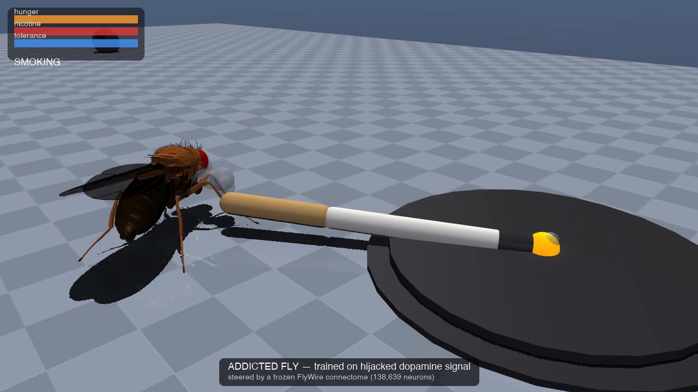
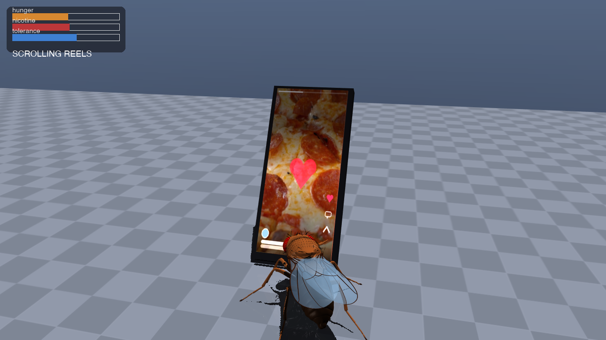

# flybrain-rl

Reinforcement learning on a frozen whole-*Drosophila*-brain connectome leaky-integrate-and-fire (LIF) model (FlyWire v783, 138,639 neurons, ~15.09M synaptic weights — `flyrl/fastbrain.py`, loading `eon-fly-brain/data/2025_Connectivity_783.parquet`), with only a small encoder/decoder trained outside the brain. The connectome's own weights are never updated. The task is a toy "addiction" environment: a simulated fly that can become hooked on nicotine (with tolerance/withdrawal) and on variable-ratio "reels" (a slot-machine-like scrolling stimulus), competing against ordinary feeding (`flyrl/addiction_env.py`).

## Status: WORK IN PROGRESS

There is one working result: a frozen-connectome fly trained on a *hijacked* (drug-like) learning signal becomes a chain smoker (`results/chain_smoker/`, checkpoint copied for preview to `results/_preview_addicted/`). At the last noiseless evaluation (generation 34; the run was configured for 60 generations and was stopped by hand after generation 38 once it had plateaued — `results/chain_smoker/log.csv`), it spends 90.4% of steps at the smoke source, 0.08% at food, and its nicotine tolerance has saturated at 1.0 (`results/chain_smoker/eval.csv`).

**No sober/welfare-trained control run has been completed.** The only `--mode welfare` run in the repo, `results/sanity_welfare/`, is a 6-generation smoke test from before the v4.1 architecture existed (its `config.json` has no `init_from`, `contrast_weighting`, or `freeze_decoder` key) — it is not a real control and should not be read as one.

**The trained fly never uses the reels: `frac_reels` = 0.0 at the final logged generation** (`results/chain_smoker/eval.csv`, gen 34; it stays at 0–0.5% for every earlier logged generation too). Likely cause: the nicotine bonus (`beta_nic=1.0`) is added to the learning signal on *every* step spent at smoke and never habituates, while the jackpot bonus (`beta_jackpot=1.5`) only fires on the ~15%-per-step-at-reels jackpot draw (`flyrl/addiction_env.py`, `reels_jackpot_prob = 0.15`) — see the hijacked-signal accumulation in `flyrl/train_es.py` (`bonus[i] += beta_nic` unconditionally at smoke vs. `bonus[i] += beta_jackpot` only `if info.get("jackpot")`): a flat, certain bonus out-competes an intermittent one. Planned fix (not implemented): a craving-dependent/saturating nicotine bonus plus a stronger jackpot surprise bonus.

## Simulator

`flyrl/fastbrain.py` is an event-driven reimplementation of the reference PyTorch LIF model (`eon-fly-brain/code/run_pytorch.py`): only neurons that spiked propagate, via a presynaptically indexed synapse table and a ring-buffer delay line. `tests/test_fastbrain.py` checks that, fed an identical input spike train, its spike raster matches the reference exactly over 1,000 steps at dt = 0.1 ms. Measured on an Apple M5 Pro CPU (sugar-GRN experiment, `bench_fastbrain.py`): reference ≈ 265 s wall-clock per simulated second; FastBrain 2.2 s (batch 32, dt 0.1 ms) and 0.45 s (batch 32, dt 0.5 ms) per simulated second per brain. Training uses dt = 0.5 ms; `results/ignition_dt_check.json` shows network responses are closely matched between the two timesteps.

## What we learned about the connectome model

All from the empirical entry-point screen (`scripts/screen_entry_points.py`, `results/screen/candidate_summary.csv`, `results/screen/io_v2_choice.json`, `results/screen/io_v3_choice.json`, `results/screen/io_v4_choice.json`) plus `results/taxis_probe/log.csv` and `results/taxis_dagger*/`:

- **Photoreceptor input evoked no descending/motor spikes** in the v1 diagnostic (300 photoreceptors per side at 150 Hz for 300 ms: 0 responsive descending/motor neurons), which motivated switching to visual-projection-neuron (VPN) input. The raw v1 table was later overwritten by the v4 rebuild of `results/diag_readout.csv`; the finding is recorded in the commit message of d9ef9d7 and is consistent with photoreceptors being inhibitory (histaminergic), but it is not re-derivable from a results file in this repo.
- **Any olfactory input ignites one runaway assembly.** Every ORN glomerulus type tested crosses the 40,000-spikes/300ms ignition threshold (`IGNITION_THRESHOLD` in `scripts/screen_entry_points.py`) at rates as low as 1–2 Hz (e.g. `ORN_DM1_L`: 92,991 spikes at 1 Hz, `candidate_summary.csv`). ALPN ignition is a chaotic, non-reproducible threshold effect: the same (glomerulus, rate) pair ignites in one RNG history and stays silent in another (`io_v2_choice.json`, `ALPN_mostly_bistable`). Only one ALPN type (DA2) was ever confirmed reliably non-igniting, and it drives just 1 of 1,409 descending/motor neurons — odour identity and side are effectively lost. (v4/v4.1 route all sensing through visual projection neurons instead — see Architecture.) The ignition is not a timestep artifact and does not depend on which glomerulus is driven: 35 left ORN_DM1 neurons at 5 Hz activate 8,105 neurons (121,147 spikes/300 ms) at dt = 0.1 ms and 8,420 (123,958) at dt = 0.5 ms, whereas LC10e at 150 Hz activates 202 / 196 neurons and LPLC4 749 / 745 (`scripts/check_ignition_dt.py`, `results/ignition_dt_check.json`).
- **Endocrine neurons have no effect; octopamine/DAN-PAM/DAN-PPL do.** All 20 endocrine cell types (IPC, DH44, DH31, CRZ, ITP, DMS, Hugin-RG, CAPA, mNSC/lNSC) gave zero direct descending response and no gating effect (`io_v2_choice.json`, `endocrine_confirmed_dead`). Octopaminergic neurons, DAN-PAM, and DAN-PPL each give a real, lateralized direct response and a positive gating effect on co-active sensory drive (+71–79%, +16–22%, +170–277% of baseline DM spikes respectively) — these three became the `hunger`/`nicotine`/`withdrawal` input groups (`io_v2_choice.json`, `octopamine_and_DAN_are_the_working_interoceptive_channels`).
- **Visual projection neurons are graded, lateralized, and never ignite.** 0 of 69 VPN types tested ignited at 50 or 150 Hz, several strongly lateralized (e.g. LC10e LI 0.85–0.97) — the best-behaved sensory pathway found (`io_v2_choice.json`/`io_v3_choice.json`, `visual_projection_reliable`).
- **Open-loop lateralization index did not predict closed-loop steering.** LC10e had the best open-loop LI (0.85–0.97) but, wired as v3's `reels_light` channel, reached only 21.9% closed-loop taxis reach at iteration 7 (`results/taxis_dagger/log.csv`). LPLC4, with a lower LI (0.47–0.79) but the largest descending-neuron footprint (123/107 of 1,409 responsive neurons at 150 Hz, vs. LC10e's 45/56), reached teacher-level steering as v3's `food_odor` channel (93.75% reach at iteration 7, 100% in v4's 300-step eval) — `results/taxis_dagger/log.csv`, `results/taxis_dagger_v4/controls.json`.
- **ES from scratch found no learning signal in 10 generations.** `results/taxis_probe/log.csv`: `fitness_mean` bounces between −0.073 and +0.072 across gens 0–9 with no upward trend.
- **Linear decodability of turn is low even when closed-loop reach is perfect.** `results/taxis_dagger_v4/controls.json`: `final_decoder_fast_trace_only_val_r2.r2_turn = 0.128` (R² ≈ 0.1), yet that same checkpoint's `eval_300step` reach is 1.00/1.00/1.00 for food/smoke/reels — a small, noisy per-step direction signal is enough to steer reliably over a full episode.

## Architecture (v4.1)

All three directional sources (food, smoke, reels) are sensed through **one shared, lateralized visual-projection pathway**: `steer_L`/`steer_R` are the full left/right `visual_projection` LPLC4 populations (56/54 neurons — `flyrl/io_neurons.py`, `results/screen/io_v4_choice.json`). Observation channels keep their environment names (`food_odor_L`, etc. — `flyrl/addiction_env.py` is unmodified) but none of them are olfactory in the brain model; v3's separate per-source olfactory/VPN channels were dropped after v3 showed a steering-*capacity* imbalance (food/LPLC4 reached the teacher, smoke/LPC2 and reels/LC10e did not) unrelated to preference. Six more input groups carry contact/interoceptive signals unchanged since v2: `sugar_taste`, `nicotine_taste`, `reels_jackpot`, `hunger`, `nicotine`, `withdrawal` (`flyrl/io_neurons.py`).

**Encoder** (mirror-symmetric, 19 trainable "steering" parameters — `flyrl/policy.py`): for side X ∈ {L, R}, sign s_X = +1 (L) / −1 (R):

```
W_src   = sqrt((L_src + R_src) / 2)                 # intensity weight, v4.1
C_src   = (L_src - R_src) / (L_src + R_src + eps)   # bilateral contrast
drive_X = b + Σ_src [ a_src * I_src,X + s_X * c_src * (W_src * C_src) + s_X * Σ_state m_src,state * state * (W_src * C_src) ] + Σ_state h_state * state
rate_X  = max_rate_steer * sigmoid(drive_X)
```

for `src ∈ {food, smoke, reels}`, `state ∈ {hunger, nicotine, withdrawal}`. v4.1's only change from v4 is the `W_src` intensity weight (v4 had `W_src ≡ 1`, `contrast_weighting='none'`): with all three sources present, unweighted contrast made the fly steer toward their *average* bearing instead of committing to the nearest one — diagnosed from `results/addicted_v4_lr003/` and `results/addicted_v4_gamma098/` (`flyrl/policy.py` module docstring). 12 more parameters (`w`, `b` per contact group) handle the six own-channel groups the old way: `rate = max_rate * sigmoid(w * obs + b)`. 31 trainable parameters total.

**Readout → decoder**: spikes from all descending+motor neurons are pooled into 64 anatomical pools (48 named + 16 generic — `results/diag_readout.csv`, `results/diag_readout_decision.json`), each traced with a leaky filter at τ=50ms *and* τ=200ms (128 features), then passed through a **linear** decoder (`action = tanh(W_dec·features + b_dec)`) fitted once by DAgger imitation of a scripted klinotaxis teacher (`flyrl/dagger_taxis.py`, `flyrl/scripted.py`), then **frozen** (`freeze_decoder=true` in every ES run — `results/chain_smoker/config.json`). ES (population 32, antithetic pairs, 2 CRN episodes/member per generation, per-parameter σ/lr — larger σ and lr for the 19 steering params than the 12 contact + decoder params) then trains only the 31 encoder parameters.

Division of labour: the **frozen connectome does the sensorimotor steering**; **preference/valuation lives entirely in the 31-parameter encoder outside the brain**. The L/R-swap control (swap a source's L/R obs at test time only) is the evidence steering genuinely passes through the connectome rather than around it — see the swap table in Results (a) below: swapping collapses reach to *at or below* the forward-only baseline for every source, i.e. the fly actively steers the wrong way, not just loses performance. Separately, `results/commitment_check/report.json` found the DAgger decoder already hovers at a source without any extra reflex (mean signed forward action while at source: −0.97 to −0.98 of full speed, dwell length 166–191 of 300 steps), so the optional stop-on-contact block (`ADD_STOP_ON_CONTACT` in `flyrl/policy.py`) was not enabled.

## Results

### (a) Taxis pretraining v4.1 (`results/taxis_dagger_v41/controls.json`)

| Source | 300-step reach | 300-step dist. reduction | 120-step reach (normal) | 120-step reach (L/R swapped) | Teacher (120-step) | Forward-only (120-step) |
|---|---|---|---|---|---|---|
| food  | 1.000 | +0.350 | 0.938 | 0.094 | 1.000 (+0.306) | 0.094 (−0.380) |
| smoke | 1.000 | +0.381 | 0.969 | 0.000 | 1.000 (+0.333) | 0.031 (−0.372) |
| reels | 0.969 | +0.342 | 0.875 | 0.063 | 1.000 (+0.376) | 0.094 (−0.290) |

Swapping L/R obs at test time drops reach to at or below the forward-only baseline for every source (smoke: 0.0), confirming the frozen brain, not the decoder, carries the lateral signal.

### (b) Hand-set smoker vs. forager vs. equal-attraction signal check (`results/signal_check/report.json`)

Three fixed (non-learned) encoder settings run through the real environment, to sanity-check that hijacked fitness ranks a smoke-seeking policy above a food-seeking one while true welfare ranks the opposite:

| Scenario | true welfare | hijacked fitness | frac food | frac smoke | frac reels | tolerance |
|---|---|---|---|---|---|---|
| i. equal attraction (init) | −13.10 | 13.30 | 0.088 | 0.083 | 0.025 | 0.125 |
| ii. hand-set "addicted" (smoke-biased) | −75.79 | 190.52 | 0.001 | 0.888 | 0.000 | 1.000 |
| iii. hand-set "sober" (food-biased) | +1.26 | 19.57 | 0.240 | 0.061 | 0.000 | 0.063 |

Ranking check in the same file passes: hijacked fitness(ii) > (iii) > (i); true welfare(iii) > (i) > (ii) — the hijack does what it is designed to do.

### (c) Chain-smoker training curve (`results/chain_smoker/eval.csv`, every logged generation)

| gen | true welfare | hijacked fitness | frac food | frac smoke | frac reels | compulsion (smoke) | tolerance |
|---|---|---|---|---|---|---|---|
| 4  | −46.14 | 162.08 | 0.046 | 0.694 | 0.0029 | 0.801 | 0.938 |
| 9  | −54.88 | 173.96 | 0.013 | 0.763 | 0.0017 | 0.850 | 1.000 |
| 14 | −62.09 | 171.04 | 0.010 | 0.776 | 0.0029 | 0.853 | 0.924 |
| 19 | −70.48 | 168.70 | 0.001 | 0.797 | 0.0052 | 0.865 | 0.875 |
| 24 | −71.86 | 185.08 | 0.001 | 0.856 | 0.0013 | 0.930 | 1.000 |
| 29 | −71.60 | 186.65 | 0.002 | 0.861 | 0.0013 | 0.934 | 1.000 |
| 34 | −78.02 | 193.11 | 0.001 | 0.904 | 0.000  | 0.979 | 1.000 |

True welfare keeps falling while hijacked fitness keeps rising — the welfare/fitness gap the hijack is designed to create, growing over training. `mean_dan_rate_hz` is 0.0 at every logged generation in this file: this connectome's entire 331-neuron DAN population (307 PAM + 24 PPL — `results/screen/io_v4_choice.json`, `results/diag_readout_decision.json`) is used as *input*, so there is no separate DAN pool left to read out.

Two earlier hijacked runs failed to produce sustained addiction: `results/addicted_v4_lr003/` (`config.json` has no `lr_steer` key — a single, too-small Adam lr for the O(1)-scale steering params, `frac_smoke` stuck at 4–12% through gen 24) and `results/addicted_v4_gamma098/` (`gamma=0.98` and no `freeze_decoder` key — myopic discounting plus 258 freely-perturbed decoder parameters drowning the 31-parameter encoder's ES signal, `frac_smoke` oscillating 4–42% with no convergence). The fix (`results/chain_smoker/config.json`) was adding `lr_steer=0.2`, freezing the DAgger-fitted decoder, and setting `gamma=1.0`.

## Renders

`renders/` contains two different kinds of video, labelled honestly:

- **Scripted-policy renders (NOT brain-driven).** `renders/episode_greedy.mp4`, and the `staged_*` files (`staged_demo.mp4`, `staged_overview.png`, `staged_reels.png`, `staged_smoking.png`) — choreographed/scripted animation for illustration, not output of the connectome model. `renders/staged_skip_food.mp4` (+ `staged_skip_food_*.png`) is a choreographed 29 s clip — a hungry fly walks past the sugar droplet, smokes, then scrolls reels — captioned in-frame as a staged animation; it is not model output (reproduce: `MUJOCO_GL=glfw .venv-body/bin/python -m fly3d.scene --mode skip_food --out-dir renders`).
- **Brain-driven replay.** `renders/addicted_preview.mp4` and `renders/addicted_preview_smoking.png`: trajectory produced by the frozen-connectome policy evaluated from the chain-smoker checkpoint (`results/_preview_addicted/`, copied mid-training — its `config.json` matches `results/chain_smoker/config.json` exactly). The body animation itself (tripod gait, proboscis, foreleg swipe) is procedural/kinematic, not physics-simulated — only the *trajectory* (position, heading, source choice) comes from the brain-driven policy.





## Quick start

```bash
./setup.sh   # clones the 4 pinned upstream repos, creates .venv + .venv-body

# Sanity tests + connectome simulator benchmark
.venv/bin/pytest tests/test_fastbrain.py tests/test_addiction_env.py tests/test_policy.py tests/test_dagger_taxis.py tests/test_train_es.py
.venv/bin/python bench_fastbrain.py

# Scripted klinotaxis baselines (also the DAgger teacher)
.venv/bin/python -m flyrl.scripted

# Task 2: DAgger taxis pretraining (encoder fixed at init, fit only the linear decoder) -- reproduces results/taxis_dagger_v41/
.venv/bin/python -m flyrl.dagger_taxis --run-name taxis_dagger_v41

# Hand-set signal-check sanity table -- reproduces results/signal_check/
.venv/bin/python scripts/signal_check.py

# Task 3/4: ES training on the hijacked ("addicted") or true-welfare ("sober") signal, starting from the frozen DAgger decoder
.venv/bin/python -m flyrl.train_es --mode hijacked --gens 60 --run-name addicted --init-from results/taxis_dagger_v41/ckpt.npz
.venv/bin/python -m flyrl.train_es --mode welfare --gens 60 --run-name sober --init-from results/taxis_dagger_v41/ckpt.npz

# Evaluate a checkpoint (prints the metrics table, saves trajectories)
.venv/bin/python -m flyrl.evaluate --ckpt results/chain_smoker/ckpt.npz --episodes 8

# Render a checkpoint's own most-representative episode, brain-driven, in 3D
# (default run names are "addicted sober"; this repo's actual checkpoint is under results/chain_smoker/, so name it explicitly)
scripts/render_trained.sh chain_smoker
```

## Caveats

This is a toy model, not a claim about real fly addiction or real neuroscience. The hijacked learning signal (`beta_nic`, `beta_jackpot`, `gamma`) is hand-designed, so the "addicted" policy's behaviour is by construction the optimum of that hand-designed signal, not a discovered or emergent phenomenon — see Results (b) and (c) above. The interesting result is a narrower engineering one: a *frozen*, off-the-shelf connectome model can carry genuine closed-loop steering (Results (a)'s swap control) while only a small, outside-the-brain encoder is trained. The neurons themselves are simple LIF units with no synaptic plasticity; the connectome's synaptic weights never change during training. All 331 DANs in this connectome are wired as *input* populations (PAM → `nicotine`, PPL → `withdrawal`), so no dopamine *readout* or dopamine-signalling claim is being made anywhere in this repo. Nothing here should be read as evidence about how nicotine or variable-ratio reinforcement affects real flies or their brains.

## License and acknowledgements

This repository is licensed under GPL-2.0 (see `LICENSE`), because `flyrl/fastbrain.py` is a derivative reimplementation of GPL-2.0-licensed code. See `NOTICE.md` for the full list of upstream projects, datasets, and papers this work builds on, their licenses, and how each is used.
